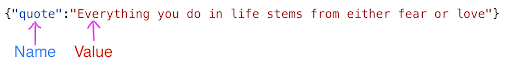
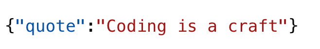
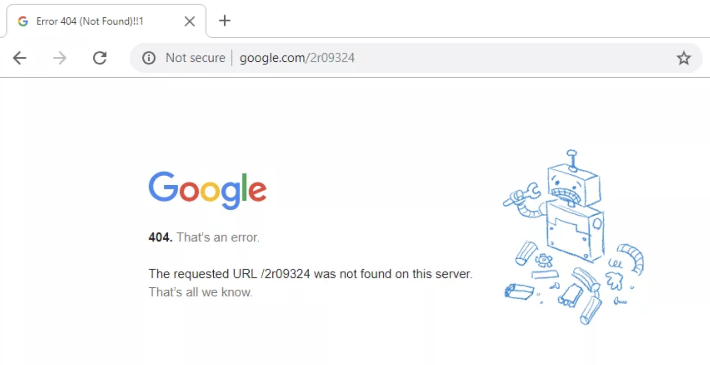
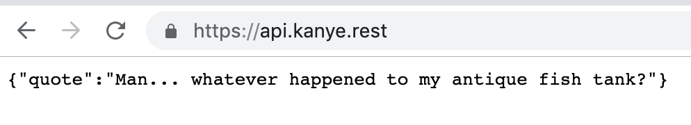
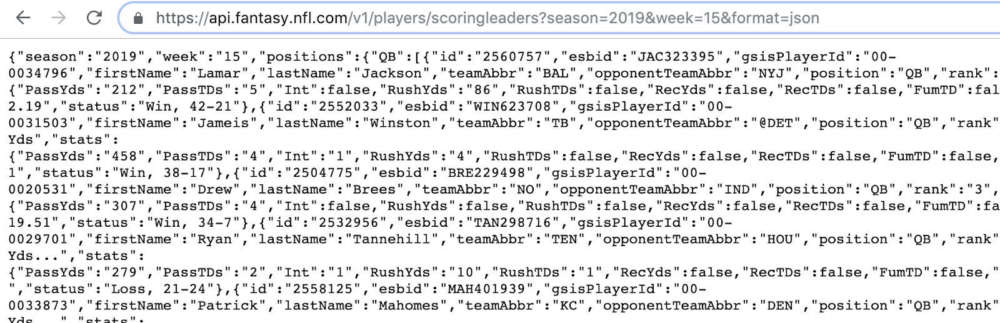
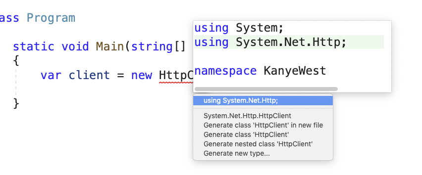
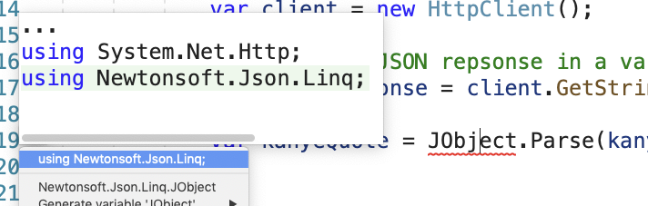

# APIs and JSON

## Why:

The first web API was created by eBay.  eBay came up with this idea in 2000, and now more than half of the items sold on eBay are through the API, and not the website.  We teach about APIs because APIs let developers create apps that bring together data from different sources. JSON grew out of a need for [stateless](https://en.wikipedia.org/wiki/State_(computer_science)), real-time server-to-browser communication protocol without using browser plugins such as Flash or Java applets, the dominant methods used in the early 2000s. **Douglas Crockford** originally specified the JSON format in the early 2000s. JSON was first standardized in 2013, as ECMA-404.  The latest JSON format standard was published in 2017 as RFC 8259 and remains consistent with ECMA-404. The ECMA and ISO standards describe only the allowed syntax, whereas the RFC covers some security and interoperability considerations.

## What:

## **API**
API stands for **application programming interface**. It defines how two pieces of software will communicate with each other. 

APIs let developers create apps that bring together data from different sources.

For example, let's say you wanted to create an app that shows how to get to the nearest dog park. How would you use APIs to build this? Several cities now provide APIs that list where all the dog parks are. Google Maps provides an API that says how to get to a given location. Your app first calls the city API, then, once it has a location, it calls the Google API, and gets the directions. So with APIs, apps can bring data together in new ways that no-one has thought of before. !

In our examples, we will call web APIs and receive a response containing JSON.

## **JSON**

**JSON (JavaScript Object Notation)** is a lightweight data-interchange format. It is easy for humans to read and write. 

It is easy for machines to parse and generate. It is based on a subset of the JavaScript Programming Language Standard.

**When exchanging data between a browser and a server, the data can only be text**.

**JSON is text, and we can convert any JavaScript object into JSON, and send JSON to the server.**

*JSON is a text format that is completely language independent but uses conventions that are familiar to programmers of the C-family of languages, including C, C++, C#, Java, JavaScript, Perl, Python, and many others. These properties make JSON an ideal data-interchange language.*


JSON is built on two structures:

1. A collection of name : value pairs. In various languages, this is realized as an object, record, struct, dictionary, hash table, keyed list, or associative array.



2. An ordered list of values - like an array.  In the below example we have an array of cars contained in brackets [ ].  We even have nested arrays inside of the cars array:

```json
myObj = {
  "name":"John",
  "age":30,
  "cars": [
    { "name":"Ford", "models":[ "Fiesta", "Focus", "Mustang" ] },
    { "name":"BMW", "models":[ "320", "X3", "X5" ] },
    { "name":"Fiat", "models":[ "500", "Panda" ] }
  ]
 }

```
These are universal data structures. Virtually all modern programming languages support them in one form or another. It makes sense that a data format that is interchangeable with programming languages that are also based on these structures.

In JSON, they take on these forms:
- **Object** - an unordered set of name/value pairs. An object begins with { and ends with }. Each name is followed by a colon and the name/value pairs are separated by a comma.  Here is an object:



- **Array** - An array is an ordered collection of values. An array begins with [ and ends with a ]. Values are separated by a comma.  Here we have an array phone numbers:

```json
{
  "firstName": "John",
  "lastName": "Smith",
  "isAlive": true,
  "age": 27,
  "address": {
    "streetAddress": "21 2nd Street",
    "city": "New York",
    "state": "NY",
    "postalCode": "10021-3100"
  },
  "phoneNumbers": [
    {
      "type": "home",
      "number": "212 555-1234"
    },
    {
      "type": "office",
      "number": "646 555-4567"
    },
    {
      "type": "mobile",
      "number": "123 456-7890"
    }
  ],
  "children": [],
  "spouse": null
}

```

### **REST:**

Representational State Transfer - REST
is a language-independent architecture that provides interoperability between computer systems on the Internet.  It utilizes a stateless protocol aiming for fast performance and reliability.

REST Verbs:
RESTful web services allow us to perform CRUD operations.  A RESTful API is an application program interface (API) that uses HTTP requests to GET, PUT, POST and DELETE data.

It translates like this:

| Create | Read  | Update | Delete |
| :---:  | :---: | :---:  | :---: |
| Post   | Get   | Put    | Delete |


### **Stateless:**
Stateless means each request from client to server must contain all of the information necessary to understand the request, and cannot take advantage of any stored context on the server. Session state is kept entirely on the client.
These constraints improve the properties of visibility, reliability, and scalability. Visibility is improved because a monitoring system does not have to look beyond a single request datum in order to determine the full nature of the request. Reliability is improved because it eases the task of recovering from partial failures. Scalability is improved because not having to store state between requests allows the server component to quickly free resources and further simplifies implementation.


### **HTTP Status Codes:**
- **1xx – Informational**

- **2xx – Success**
This class of status code indicates that the client's request was successfully received, understood, and accepted.
- **3xx – Redirection**
The client must take additional action to complete the request.
- **4xx – Client Error**
Like 404



The 4xx class of status code is intended for cases in which the client seems to have erred. Except when responding to a HEAD request, the server should include an entity containing an explanation of the error situation, and whether it is a temporary or permanent condition. These status codes are applicable to any request method. User agents should display any included entity to the user.

- **5xx – Server Error**
The server failed to fulfill an apparently valid request

## How:
If we were to type an API endpoint in a browser we might see a JSON response like this:



Or we might see a response like this:



### **Let’s create a console application and name it KanyeWest.**

Add the Newtonsoft.Json Nuget package.  This will allow us to grab our JSON response from the https://api.kanye.rest API

Here we create a new instance of the HttpClient class which provides a base class for sending HTTP requests and receiving HTTP responses from a resource identified by a URI.

```cs
var client = new HttpClient(); 
```



Next, we send a GET request to the specified Uri and return the response body as a string in an asynchronous operation.  Basically, we get a string of JSON back

```cs
var kanyeResponse = client.GetStringAsync(kanyeURL).Result;
```

Now we can parse through our JSON response and grab the values we are interested in.  In this case, we grab the VALUE associated with the “quote” NAME.  
Remember, JSON uses a NAME : VALUE pairing system.

```cs
var kanyeQuote = JObject.Parse(kanyeResponse).GetValue("quote").ToString();
```



**Fun APIs to check out:** https://medium.com/@vicbergquist/18-fun-apis-for-your-next-project-8008841c7be9

**REST Flashcards:**
https://quizlet.com/156614639/restful-web-services-flash-cards/

# Exercise: 
**VIDEO:** https://vimeo.com/442168625/102b3ca67a

Let’s create a console application that calls both the Ron Swanson API, and the Kanye West API.  Using both APIs, make Ron Swanson and Kanye West have a conversation that prints to the console.

**Hints:**
Use a for loop to generate at least 5 quotes from each api and have them alternate to simulate a conversation

Here is some code to utilize for parsing the ron swanson response:
```cs
var ronQuote = JArray.Parse(ronResponse).ToString().Replace('[', ' ').Replace(']', ' ').Trim();
```

**Here are the API urls:**
- https://ron-swanson-quotes.herokuapp.com/v2/quotes
- https://api.kanye.rest

**FINISHED Project:** 
https://github.com/mvdoyle/KanyeAndRonSwanson

--------------------------
### **Quiz:**
https://drive.google.com/open?id=1IsZ_vXV6XXVRKSgFe6elsUFmjxuB9azqTtQ9f7w0A7E

Sources:
- https://www.w3schools.com/js/js_json_intro.asp
- https://www.linkedin.com/learning/learn-api-documentation-with-json-and-xml/why-document-json-and-xml

- https://www.json.org/json-en.html

- https://www.programmableweb.com/api-university/what-are-apis-and-how-do-they-work

- https://en.wikipedia.org/wiki/JSON#cite_note-Edu4java,_2014-12

- https://www.restapitutorial.com/index.html

- https://www.ics.uci.edu/~fielding/pubs/dissertation/rest_arch_style.htm

- https://searchapparchitecture.techtarget.com/definition/RESTful-API

-------

**BONUS:**  How to work with the Call of Duty API

API: https://rapidapi.com/elreco/api/call-of-duty-modern-warfare/endpoints

**VIDEO:** https://vimeo.com/445280332/768023b88b
