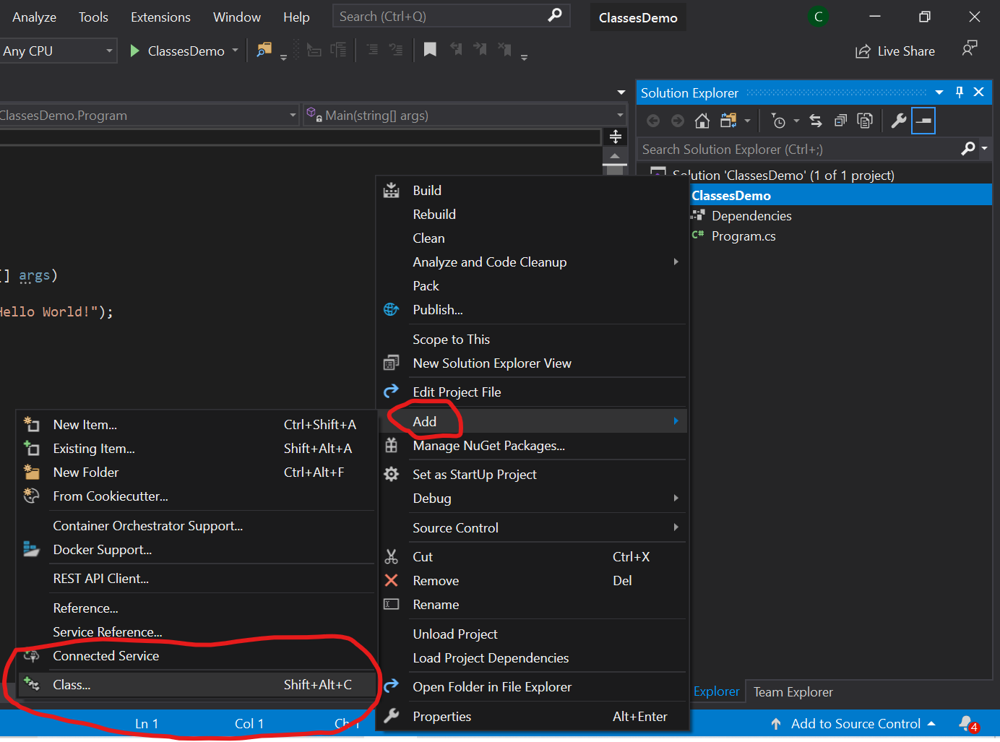
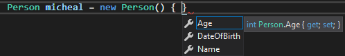
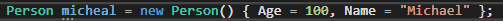
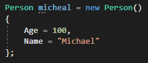

# Classes

## Why:
Before classes and Object-Oriented Programming was a thing, programmers used functional programming as a programming paradigm. Functional programming allows building a program using mathematical functions. In other words, it binds the program into a purely mathematical function. Using functional programming, the developer can build a program as a combination of separate mathematical functions. Enter the early 1960’s, OOP was invented, the first programming language to use objects was Simula 67. 
Classes are the cornerstone of Object-Oriented Programming. They help you take all the properties and behaviors of an object in your program, and combine them into a single object, then re-use that object wherever you need it in your program. Using classes in your code enables you to implement **Encapsulation, Abstraction, Inheritance, and Polymorphism**. These principles define OOP and they revolve around classes, which is why we teach them now.

## What:
A class can be thought of as a blueprint or a cookie cutter. A class describes an object, but it is not that object. An object is defined as a singular instance of a class or type. It is a block of memory that has been allocated on the heap, according to the blueprint. Similar to real-life if you have a blueprint of a house, it is not an actual house, the blueprint only tells you how to build a house. Moreover, if you create 2 houses from the same blueprint, they may seem the same but they are independent of each other. In the real world objects have describing factors such as color, speed, or weight; to name a few. In code, we create classes in order to group these things together. Classes have members sort of like how methods have variables; however, classes are not only limited to variables. 

Examples of class members are: (members belong to the class like a club has memberships)

- **Fields** - a variable of any type that is declared directly in a class or struct.
- **Properties** - a member that provides a mechanism to read, write, or compute the value of a private field.
- **Methods** - a code block that contains a series of statements to execute.
- **Constructors** - Whenever a class or struct is created, its constructor is called.

The way we access the methods and properties of a class is with the ( . ) Dot operator, Dot Notation, or Class Member Access Operator. They are all names for the same thing.

```cs
var myObject =  new Object();
myObject.FirstProperty; // DOT NOTATION
```


Parts of a class
- Access Modifier Keywords - **OPTIONAL**
- class keyword - **REQUIRED**
- Name - **REQUIRED**
- Scope or “curly brackets” - **REQUIRED**
- Fields/Properties - **OPTIONAL**
- Methods - **OPTIONAL**

## How:
Now we will talk about how to create a class. When we would like to create a new class we will go to our solution explorer and right-click on our project file, and go to add then click on class.



We can name our class whatever it may be. Note: classes follow the PascalCase naming convention. Ex: class Car{}, class FastCar{}, class UserCheckingAccount{}. Here is a simple class:

```cs
public class Dog
{
    public Dog(string name)  // Constructor
    {
        Name = name;
    }	

    private int _numberOfLegs;  // Field	
    public string Name { get; set; } // Property
		
    public void Speak() { Console.WriteLine(Name);} // Method in the class
}
```

Note: if you do not add an access modifier to the class i.e: public, private, internal, etc... the default will be internal while the class’ members will default to private unless specified!

**Pro Tip:**  In order to avoid defaults causing you access grief. Make a practice of explicitly assigning accessibility.

Now that we have a blueprint of a dog, we need to create an instance of a dog. An instance would be the actual Dog and not just the blueprint of the Dog. The way to do this is with the new keyword. Here is an example of that.

```cs
Dog myFirstDog = new Dog();
Dog mySecondDog = new Dog();

myFirstDog.Name = "Fido";
mySecondDog.Name = "Snoopy";

myFirstDog.Speak();
mySecondDog.Speak();
```

Here we have 2 instances of a Dog class. As you can see instantiating a class is very much like declaring a variable, just a few differences. We can see that in order to instantiate a class we need a Type, Name, and Value. (Note you can declare a class without a value as well. So at a minimum, you need the type and name). Each dog has a name that is unique from each other and they both have a Speak method that prints their unique name to the console. In our example, myFirstDog has a name (myFirstDog.Name) that we assign to Fido. Likewise, we have myFirstDog.Speak() that we access the same way. Each instance has the same properties available to them but it’s the values that are different between the two.

It is important to know that you can use object initializer syntax as well to add values to an object’s properties and fields while the object is being instantiated. Observe the examples below. 



This is the syntax for using an **object initializer** in C#. Just add curly braces after the constructor. From here you can assign values inline to the object’s properties and/or fields. Notice the IntelliSense that appears showing the visible members we have available.



Here you simply pick the properties you wish to assign values to and initialize them as you normally would, separated by a comma. (Note you do not have to assign all properties or fields, only the ones you deem necessary)



This is the same example but just demonstrating that you can expand the syntax out to have one member per line. This is useful if there are many members to maintain readability.

------

### Time to look at constructors: 
A **constructor** is a special method that gets invoked when we want to **instantiate** (create) a new instance of a class. If we see from the example, when we instantiate a Dog, on the right side of the assignment operator (=), we have: new Dog() this looks similar to a method call, because well, it is. When we type this, we are telling the compiler that we wish to Construct a new Dog using the **default constructor** or a **“Parameterless Constructor”**, which in turn the program will allocate memory for the object on the heap. We know that creating a constructor in a class is optional, this is because if we do not specify a custom constructor in the class, the C# compiler will use the built-in default constructor. **That being said if we DO create a constructor we cannot use the default as it is overridden.** You can have multiple constructors for any given class so long as they accept different arguments. 

(Note: if you wish to have a default constructor as well, you can recreate it.) 

Example:
```cs
// Default Constructor 
public Dog() 
{
    
}

// Parameterized Constructor 
public Dog(string name)
{
    //Constructor to assign Name property
    Name = name;
}

// Parameterized Constructor
public Dog(string name, int age)
{
    // Constructor to assign Name and Age properties
    Name = name; 
    Age = age;
}
```

Pro tip: the shortcut to creating a constructor is: ctor + tab, tab. This is called a code snippit. There are many snippits to choose from like for, fore, if, while, ect. Using code snippets isn’t advised for people learning to code.

# Exercise 1:

Video: https://vimeo.com/453778235/e3c5796732

1. Create a new C# .Net Core Console App 
2. Create a class named Car - make sure it is public
3. In the Car class,
    - Create a Make property of type string that is public
    - Create a Model property of type string that is public
    - Create a Year property of type int that is public
4. In the Main method,
    - Create a new instance of the Car class
    - Set values in the properties for the object
    - Print the values of each property to the Console
    
# Exercise 2: 
Watch these videos for help when completing the exercise!

**Mac:** https://youtu.be/pyX0wzAbwAw

**Windows:** https://drive.google.com/file/d/18kjaYSx4bLUfUexwTV3AQAdcpwVD7Njs/view?usp=sharing
Both have value regardless of your OS!!

- Fork the project from GitHub
- Clone it to your local machine
- Do the TODO's
- Push to your GitHub!
	
**Project Link:** https://github.com/mvdoyle/CarLotSimulator

------
### QUIZ:
https://drive.google.com/open?id=1c4XM0orUDA17s1BTsnNVO4EEW73nphXucKgGS5Algmk
