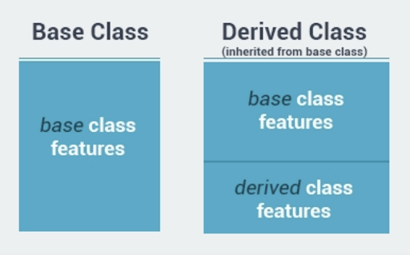
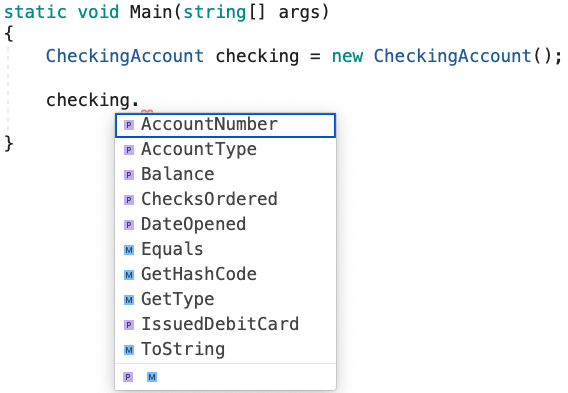

# C# Inheritance

## Why:
Inheritance, together with encapsulation, abstraction, and polymorphism, is one of the four pillars or primary characteristics of object-oriented programming. Inheritance enables you to create new classes that reuse, extend, and modify the behavior that is defined in other classes.

## What:
The class whose members are inherited from is called the base class, and the class that inherits those members is called the derived class. This is done by using a colon “:” after the derived class and then typing the name of the base class. When you define a class to derive from another class, the derived class implicitly gains all the members of the base class, except for its constructors and finalizers. The derived class can thereby reuse the code in the base class without having to re-implement it. In the derived class, you can add more members. In this manner, the derived class extends the functionality of the base class. Examples in the “How”

**Inheritance** allows us to define a class based on another class. This makes creating and maintaining an application easy.



- The class whose properties are inherited by another class is called the **Base** class.
 
- The class which inherits the properties is called the **Derived** class.

For example, base class Animal can be used to derive Cat and Dog classes.
The derived class inherits all the features from the base class, and can have its own additional features.
 
**Inheritance allows us to define a class based on another class.

```cs
public class Animal
{
 	public Animal()
	{

    }	

    public int Legs {get; set;}
 	public int Age {get; set;}
}
 
public class Dog : Animal 
{
    public Dog()
    {
        Legs = 4;
    }

    public string OwnerName {get;set;}
    public string FavoriteToy {get;set;}
}

public class Labrador : Dog
{
	
}

```

Inheritance allows the derived class to reuse the code in the base class without having to rewrite it. And the derived class can be customized by adding more members. In this manner, the derived class extends the functionality of the base class.
 
**C# does not support multiple inheritance, so you cannot inherit from multiple classes.**

However, you can use interfaces to implement multiple inheritance.  To put it another way, a class can conform to multiple interfaces

Moreover, the derived class cannot inherit the constructor of the base class because constructors are not instance members of a class

## How:

- First, we create a base class called "BankAccount"
```cs
class BankAccount()
{

}
```

- Then we give it members that all derived bank accounts would need
```cs
class BankAccount
{
    public long AccountNumber {get; set;}
    public double Balance {get; set;}
    public string DateOpened {get; set;}
    public string AccountType {get; set;}
}
```

- Then create a derived class called “CheckingAccount” and set it to inherit from our base class, since a checking account will need all of the same members of a standard bank account. Then we give it members specific to a Checking Account

```cs
class CheckingAccount : BankAccount
{
    public int ChecksOrdered {get; set;}
    public bool IssuedDebitCard {get; set;}
}
```
- Now when we access our class through the instance we create, we can also assign values to the inherited members as well as its non-inherited members



```cs
static void Main(string[] args)
{
    CheckingAccount checking = new CheckingAccount();

    checking.AccountNumber = 2517859648;
    checking.Balance = 254.93;
    checking.DateOpened = "19 Nov 2012";
    checking.AccountType = "Checking";
    checking.ChecksOrdered = 500;
    checking.IssuedDebitCard = true;
}
```

# Exercise 1: 

**Videos:**
- Mac: https://youtu.be/t_GVycbyBQw
- Windows: https://drive.google.com/file/d/19UPlC9SNMABFiBmOUwNWFU-pxNMgagFA/view?usp=sharing

1. First, FORK the repository from https://github.com/nrice41593/InheritanceExercise
2. Then, clone the repo onto your personal machine and follow the instructions in the Project. 
3. When finished, push your project back up to GitHub

# Exercise 2:

**Video:**
https://vimeo.com/454535918/a8b4925ed1

**Complete the following Codewars challenge:**
	https://www.codewars.com/kata/547274e24481cfc469000416/train/csharp

### **Quiz:**
https://docs.google.com/forms/d/1H4K3G4ZTprsMvGDbePJTtkJcGwh0XYTfv2xH2OtlyMo/edit
