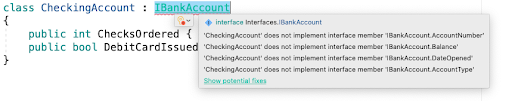

# C# Interfaces

## Why: 
Interfaces in C # provide another way to achieve runtime polymorphism. What is runtime polymorphism? By runtime polymorphism, we can point to any derived class from the object of the base class at runtime that shows the ability of runtime binding. In Object-oriented languages like C#, we can use pointers to achieve runtime polymorphism. Using interfaces we can invoke functions from different classes through the same Interface reference, whereas using virtual functions we can invoke functions from different classes in the same inheritance hierarchy through the same reference. Before things start getting difficult let me start using simple and short examples to explain the concept of interfaces.

## What: 
An interface is a completely abstract class, which contains only abstract members.  It is declared using the interface keyword.
By using interfaces, you can, for example, include behavior from multiple sources in a class. That capability is important in C# because the language doesn't support multiple inheritances of classes. 
When a class or struct implements an interface, the class or struct must provide an implementation for all of the members that the interface defines. The interface itself provides no functionality. However, if a base class implements an interface, any class that's derived from the base class inherits that implementation.  

###### Remember:
**An interface does not care about the implementation. It merely requires that it is implemented.**

## How: 
- Let’s consider the previous lesson with inheritance, we had a base class called “BankAccount” and a derived class called “CheckingAccount” that inherited from our base class.

```cs
class BankAccount
{
	public long AccountNumber {get;set;}
	public double Balance {get; set;}
	public DateTime DateOpened {get; set;}
	public string Account Type {get; set;}
}

class CheckingAccount : BankAccount
{
	public int ChecksOrdered {get; set;}
	public bool DebitCardIssued {get; set;}
}
```

- By changing the BankAccount class to an interface called “IBankAccount” (interface naming convention requires a capital I in front of the class name”), we’ve put a safeguard in place stating that whenever a checking account is created it will be required to have these members.

```cs
public interface IBankAccount 
{
	public int AccountNumber {get; set;}
	public double CurrentBalance {get; set;}
	public DateTime DateOpened {get; set;}
	public string AccountType {get; set;}

	public void Deposit(double amountToDeposit);

	public void Withdraw(double amountToWithdraw);
}
```

- If you notice below, we are throwing an error, this is because our CheckingAccount does not have the interface members and methods that are required per our “contract” with IBankAccount



- We fix this by implementing the interface members and methods within our CheckingAccount class

```cs
public class CheckingAccount : IBankAccount
{
	public int AmountOfChecksOrdered {get; set;}
	public bool DebitCardIssued {get; set;}
	public int AccountNmber {get; set;}
	public double CurrentBalance {get; set;}
	public DateTime DateOpened {get; set;}
	public string AccountType {get; set;}

	public void Deposit(double amountToDeposit)
	{
		bool conditional;
		double attemptedAnswer;
		do
		{
			Console.WriteLine("How much would you like to deposit?");
			string number = Console.ReadLine();
			if (double.TryParse(number, out attemptedAnswer))
			{
				amountToDeposit = attemptedAnswer;
			}

			Console.WriteLine("Would you like to make another deposit? Yes or No");
			string answer = Console.ReadLine().ToLower();
			if (answer == "yes")
			{
				conditional = true;
			}
			else
			{
				conditional = false;
			}			
		} while (conditional);

		CurrentBalance += amountToDeposit;
	}

	public void Withdraw(double amountToWithdraw)
	{
		bool conditional = true;
		double answer;
		do
		{
			Console.WriteLine("How much would you like to withdraw?");
			string number = Console.ReadLine();
			if (amountToWithdraw >= CurrentBalance)
			{
				Console.WriteLine("Enter an amount less than your current balance!!!");				
			}
			
			CurrentBalance -= amountToWithdraw
			Console.WriteLine("Would you like to make another withdrawal?");
			string answer = Console.ReadLine().ToLower();
			if (answer == "yes")
			{
				conditional = true;
			}
			else
			{
				condtional = false;
			}
			
		} while (conditional);
	}
}
```
- A class can also conform to multiple interfaces:

```cs
class CheckingAccount : IBankAccount, IPersonalInformation
{
	public long SocialSecurityNumber {get; set;}
	public string FirstName {get; set;}
	public char MiddleInitial {get; set;}
	public string LastName {get; set;}
	public string EmailAddress {get; set;}
	public long PhoneNumber {get; set;}

	public int ChecksOrdered {get; set;}
	public bool DebitCardIssued {get; set;}
	public long AccountNumber {get; set;}
	public double Balance {get; set;}
	public string DateOpened {get; set;}
	public string AccountType {get; set;}

}
```

- Within large companies and large projects, this is how good quality and consistent code are implemented, thus creating a form of quality assurance. 


# Exercise 
First, fork the repository from https://github.com/nrice41593/InterfaceExercise

Then, clone the repo onto your personal machine and follow the instructions in the Project. 

 **Videos:**
- Mac: https://youtu.be/ok1tnYpRGYw
- Windows: https://drive.google.com/file/d/10n-oQM-QP5Lpys2KrIFI0IuUSA_gWqG7/view?usp=sharing

 **Quiz:**
https://docs.google.com/forms/d/1Z_Q2ye7Xl9-Yr8kum3B1mgqpVxkbf9ePRIwPDD27rp0/edit
