# Using Dapper

## Why:
Programmers would prefer to exercise their creative muscles rather than type and retype data access and parameterized queries over and over. Enter **Object Relational Mappers (ORM)**.

**ORM**s are the plumbers of the programming world. They help get data out of and back into databases from our data models. Additionally, ORM's like **Dapper** will handle parameterizing your SQL statements for you and make it very easy to fire a SQL query against a database and get the result mapped to C# domain class.

## What:
ORM - Object Relational Mapper:
An Object Relational Mapper is a software abstractor that is used to access a relational database from an object-oriented language

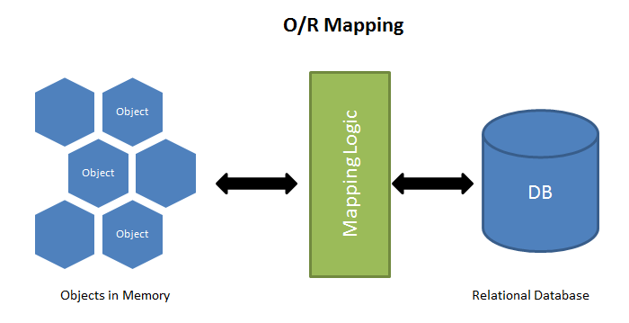

### **Dapper**:

[Dapper](https://github.com/StackExchange/Dapper) is a .NET compatible, NuGet library ORM that you can add to your project that will extend your IDbConnection interface.
Dapper has no DB specific implementation details; it works across SQLite, Oracle, MySQL, PostgreSQL, and SQL Server, to name a few.
Dapper adds a variety of things to the IDbConnection interface, but mostly you'll interact with Query and Execute.

Here is a side by side comparison of just using MySqlConnection vs using Dapper:
You might notice how much code is reduced by using the Dapper implementation

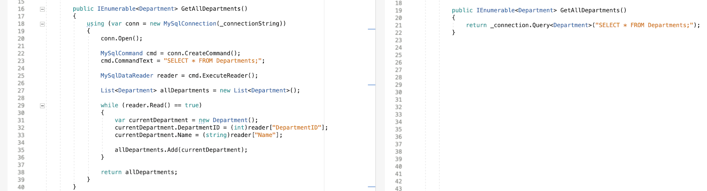

### **Query Method**:

The Dapper Query is designed for any database reads, like **SELECT**.
Query returns an IEnumerable<T>, so a select statement will return one T for each record in the database.

### **Execute Method**:

The Dapper Execute is designed for any database writes, like **INSERT**, **UPDATE**, and **DELETE**.
Execute only returns the number of records affected, so it can be ignored if you aren't interested in the affected records.

### **Moreover**:

The Dapper framework actually extends the IDbConnection interface available under the System.Data namespace. It has many extension methods for data access and mapping the result to a C# type (domain objects) defined under the SqlMapper class found under Dapper namespace. So, in order to use Dapper, first, we need to declare an IDbConnection object and initialize it to a SqlConnection to connect the database.

## How:
**Create a new .Net Core Console Application Called *IntroSQL***

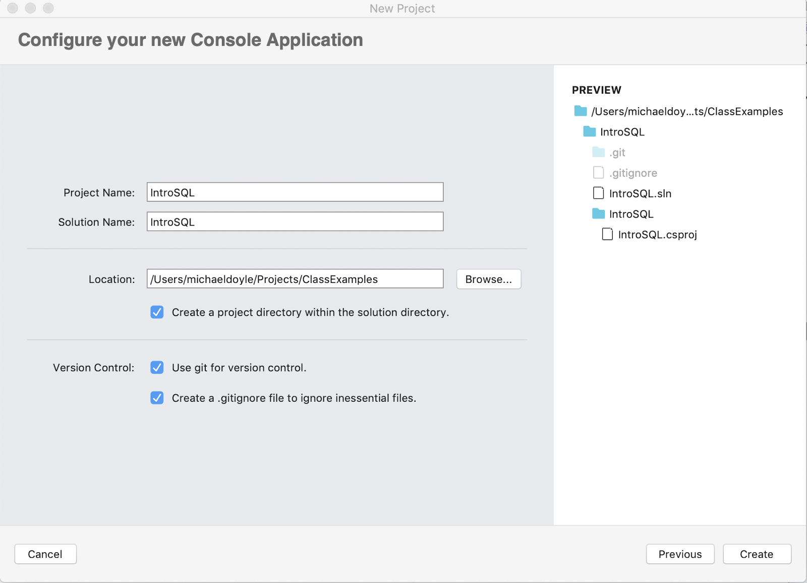

**Add appsettings.json to our .gitignore file**

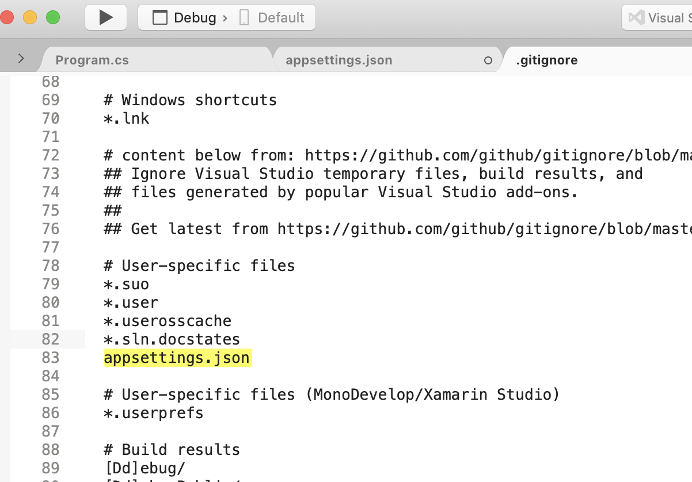

**Create our appsettings.json file:**

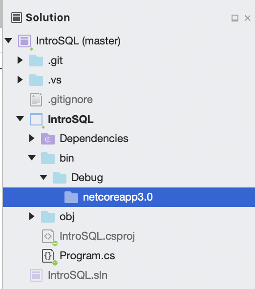

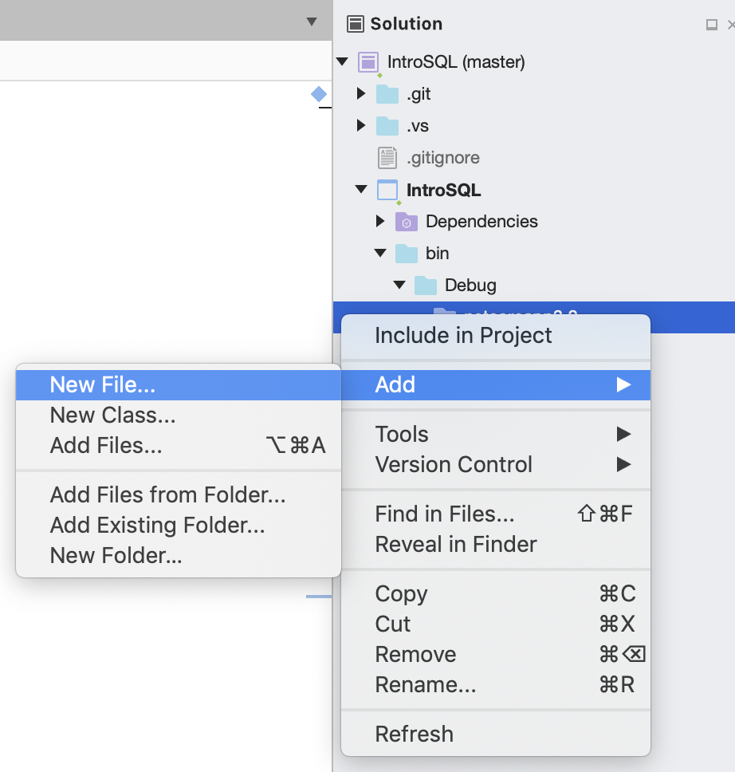

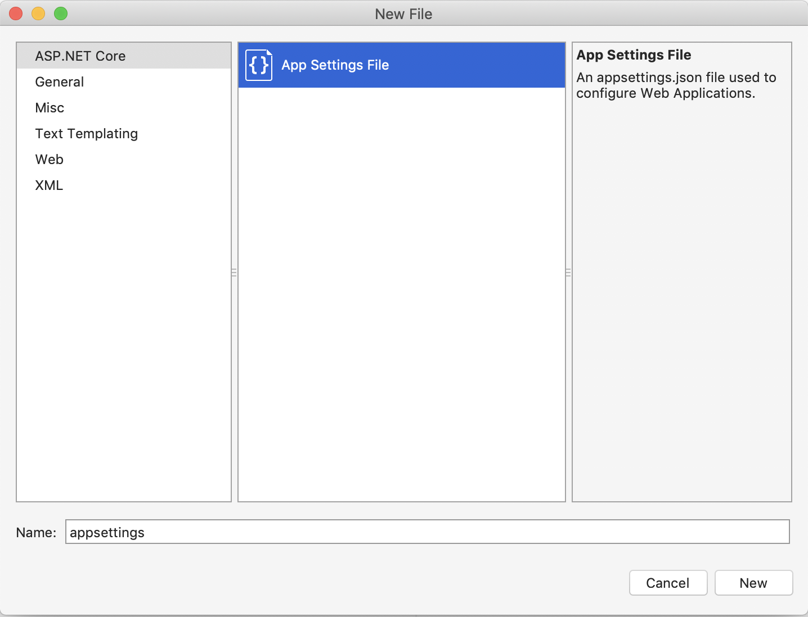

**Insert our connection information into the json file.  We will be connecting to our local MySql Server as well as our local bestbuy database:**

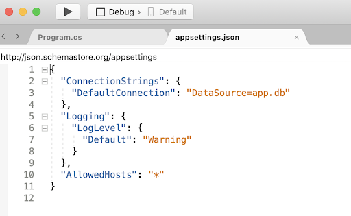

**JSON -Javascript Object Notation- file: uses name value pairs**

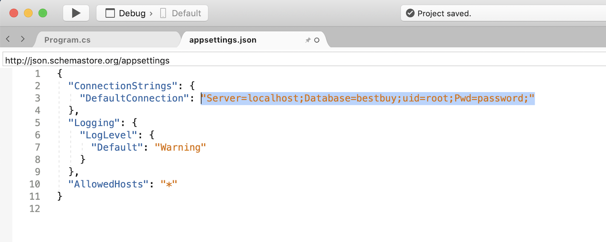

**Copy**

```json
{
    "ConnectionStrings":{
        "DefaultConnection":"Server=localhost;Database=bestbuy;uid=root;Pwd=password;"
    },
    "Logging":{
        "LogLevel":{
            "Default":"Warning"
        }
    },
    "AllowedHosts":"*"
}
```

**Check git status**: make sure git isn’t tracking the appsettings.json file

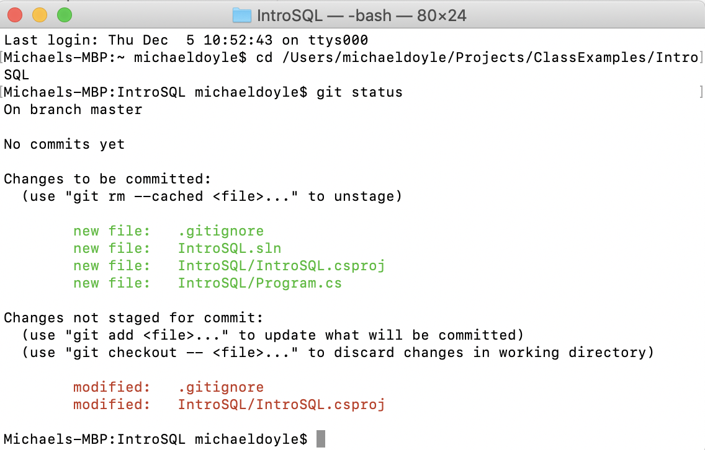

**appsettings.json** does not appear in our list of modified files

**Add 3 Nuget packages:**

1. **Dapper package:**

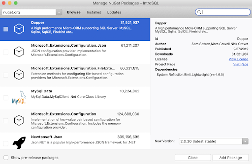

2. **Microsoft.Extensions.Configuration.Json package**

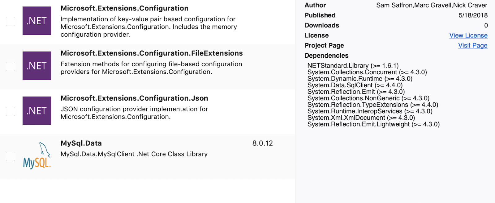

3. **MySql.Data**


**Add config and connection string to Main method (we’ll use this later):**
```cs
using System;
using System.Data;
using System.IO;
using MySql.Data.MySqlClient;
using Microsoft.Extensions.Configuration;
//MUST HAVE USING DIRECTIVES 

var config = new ConfigurationBuilder()
                .SetBasePath(Directory.GetCurrentDirectory())
                .AddJsonFile("appsettings.json")
                .Build();

string connString = config.GetConnectionString("DefaultConnection");
IDbConnection conn = new MySqlConnection(connString);
```
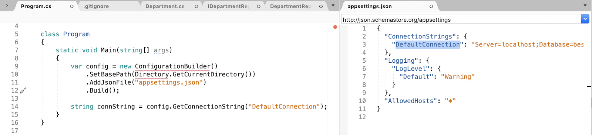

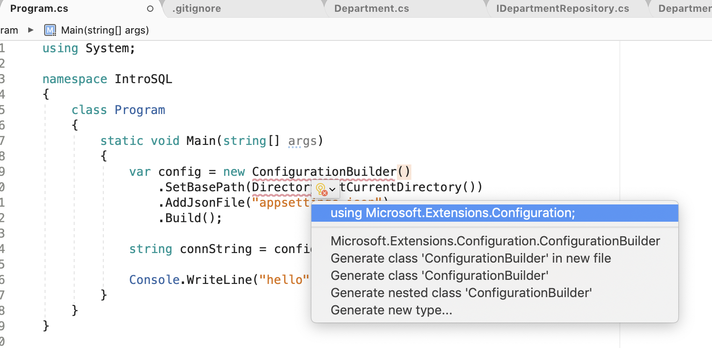

### **Create a Department class:**

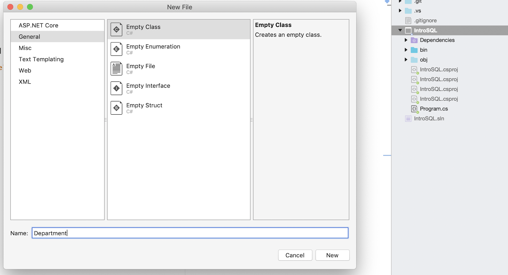

**Looking at our bestbuy database, the Departments table has two columns:**
**DepartmentID and Name**

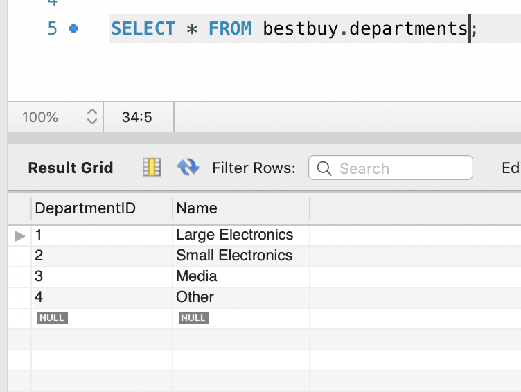

**Each Department has an DepartmentID and a Name, so we have to add these properties to our Department class**

**Add properties to the class:**

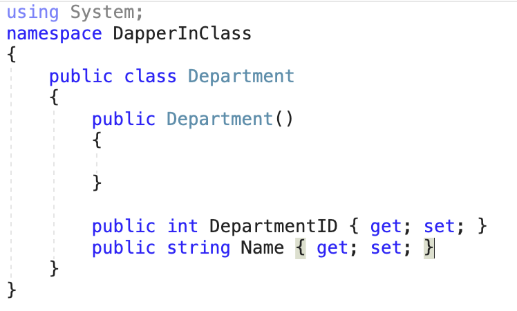

```cs
using System;
namespace IntroSQL
{
    public class Department
    {
        public int DepartmentID { get; set; }
        public string Name { get; set; }

    }
}
```

### **Create a IDepartmentRepository Interface**
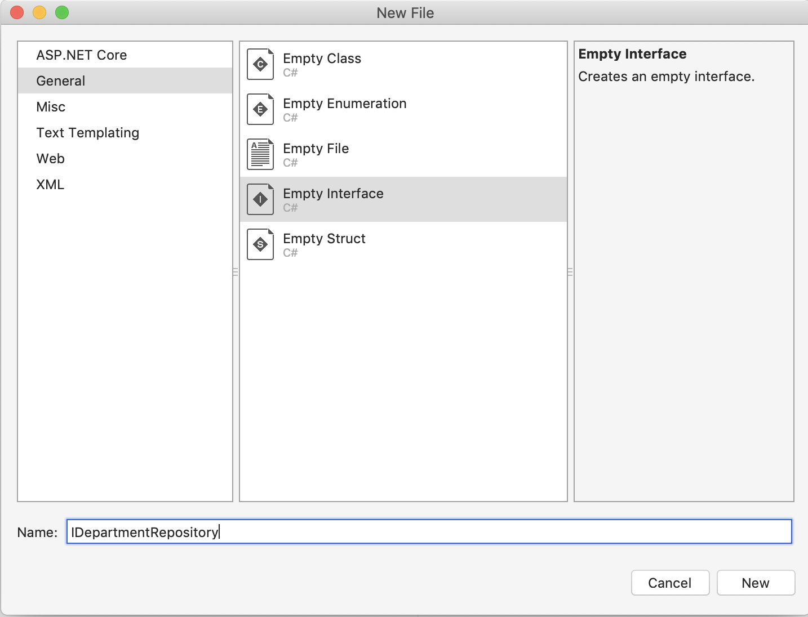

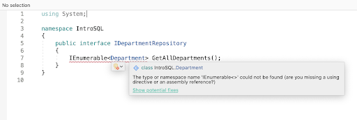

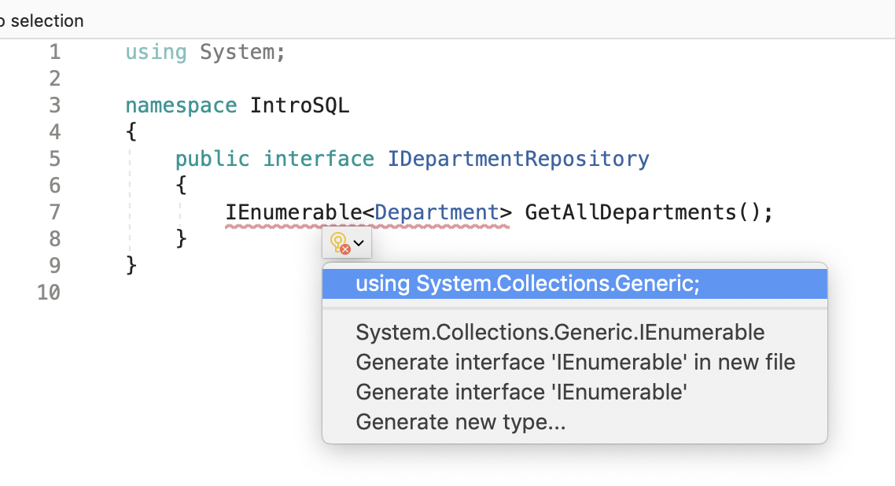

```cs
using System;
using System.Collections.Generic;

namespace IntroSQL
{
    public interface IDepartmentRepository
    {
        IEnumerable<Department> GetAllDepartments(); //Stubbed out method
    }
}

```
### **Create a DapperDepartmentRepository class:**

This Class will conform to the IDepartmentRepository interface


**Configure the Constructor:**
```cs
public class DapperDepartmentRepository : IDepartmentRepository
    {
        private readonly IDbConnection _connection;
        //Constructor
        public DapperDepartmentRepository(IDbConnection connection)
        {
            _connection = connection;
        }

```
----------------------------
***Breaking down the code***

**Constructor:**

Here, whenever we create a new instance of the DapperDepartmentRepository, we will pass in our connection string as a parameter and set that connection string in our private readonly variable _connection.  

The benefit of having _connection private and readonly is that you can't inadvertently change it from another part of the DepartmentRepository class after it is initialized. The readonly modifier ensures the field can only be given a value during its initialization or in its class constructor.

### **Create GetAllDepartments Method:**

Here, the conn.Query method is a Dapper method that executes our query and returns a value of type T.  T being whatever type we specify.  In our example, we will return an IEnumerable containing Department objects

**And:**

In this instance, we don’t need the using statement because by virtue of passing the connection in via the constructor you are stating the user of the class is responsible for the connection management. When it exits this code block then it will Dispose of and Close the connection not to be reopened

```cs
public IEnumerable<Department> GetAllDepartments()
{
    return _connection.Query<Department>("SELECT * FROM Departments;");
}
```


### **Create InsertDepartment Method:**

Here, the Execute method will execute a parameterized query for us.  @departmentName being the parameter in our query.  Like in previous lessons, the @departmentName value is ascertained from  the value of newDepartmentName

```cs
public void InsertDepartment(string newDepartmentName)
{
    _connection.Execute("INSERT INTO DEPARTMENTS (Name) VALUES (@departmentName);", 
    new { departmentName = newDepartmentName});
}
```

**DapperDepartmentRepository (Finished) :**

```cs
public class DapperDepartmentRepository : IDepartmentRepository
{
        private readonly IDbConnection _connection;

        public DapperDepartmentRepository(IDbConnection connection)
        {
            _connection = connection;
        }

        public IEnumerable<Department> GetAllDepartments()
        {
            return _connection.Query<Department>("SELECT * FROM Departments;").ToList();
        }
    

        public void InsertDepartment(string newDepartmentName)
        {
            _connection.Execute("INSERT INTO DEPARTMENTS (Name) VALUES (@departmentName);", 
            new { departmentName = newDepartmentName});
        }
}

```

**Implement in Program.cs:**

Here we can just comment out the instantiation of DepartmentRepository and implement our new instance of the DapperDepartmentRepository as seen below:


**OR With IoC Container:**

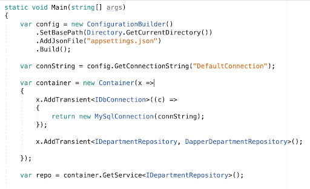

# Exercise

**Videos:**

**Mac Part 1: Nugets/Ignore/appsettings:** 
https://vimeo.com/441055543/b26dbc709f

**Mac Part 2: Implementation:** 
https://vimeo.com/441055717/62cf5829b6

**Windows Part 1: Nugets/Ignore/appsettings:** 
https://vimeo.com/441126434/0990e9c2a6

**Windows Part 2: Implementation:**
https://vimeo.com/441126432/775f65e12a

Create a C# Console App named → BestBuyBestPractices.  
Taking what we’ve learned in class, implement Dapper inside this application.

## **Exercise 1: We’ll start with Departments**

1. Ignore appsettings.json file in .gitignore and commit 

    - Windows: gitignore

    - Windows: Show all files

    - Windows: create appsettings.json

2. Create appsettings.json in netcoreapp folder
3. Check git status to make sure appsettings is ignored
4. Add MySql.Data Nuget Package
5. Add the Dapper Nuget package
6. Add the Microsoft.Extensions.Configuration.Json Nuget package
7. Make sure your config code is in your main method
```cs
var config = new ConfigurationBuilder()
                .SetBasePath(Directory.GetCurrentDirectory())
                .AddJsonFile("appsettings.json")
                .Build();

string connString = config.GetConnectionString("DefaultConnection");
IDbConnection conn = new MySqlConnection(connString);
```
8. [Create Department class](#create-a-department-class)
9. [Create IDepartmentRepository interface](#create-a-IDepartmentRepository-Interface)
10. [Create DapperDepartmentRepository class](#create-a-DapperDepartmentRepository-class)
11. [Create GetAllDepartments Method](#create-GetAllDepartments-Method)
12. [Create InsertDepartment Method](#create-InsertDepartment-Method)

## **Exercise 2: We’ll take what we’ve learned and implement Products:**

1. Create a public Product Class - this class will contain public properties that represent each column in the Products table.  
    - **Example:** public int ProductID {get;set;}

2. Create a IProductRepository Interface - this interface will have:
    - IEnumerable<Product> GetAllProducts(); *method*	
    - void CreateProduct(string name, double price, int categoryID);  *method*

3. Create a DapperProductRepository Class that conforms to the IProductRepository interface.  Here we will define our Methods:

Inside of the DapperProductRepository:
- Create a constructor
- Create a GetAllProducts method that utilizing Dapper
- Create a CreateProduct method utilizing Dapper

4. Implement our new methods in the Main method of Program.cs

## Bonus:

Create the UpdateProduct method in the DapperProductRepository class and implement in Program.cs
	
## Extra Bonus:

Create the DeleteProduct method

HINT: you will need to delete records from the Sales table and the Reviews table where that Product may be referenced.  You can do this all in the DeleteProduct method you are creating

**FINISHED VERSION:** https://github.com/mvdoyle/BestBuyBestPractices

**Quiz:**
https://forms.gle/VmS6srS1UF97fAHA7


**Sources, etc...**
https://medium.com/@mithunsasidharan/should-i-or-should-i-not-use-orm-4c3742a639ce

How to find a conn string for any DB: Connectionstrings.com 

**WINDOWS: Show all files**

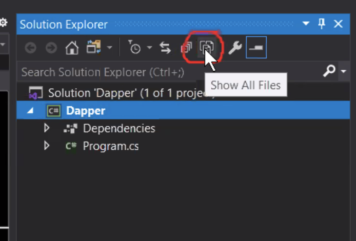

**WINDOWS: Add JSON file**

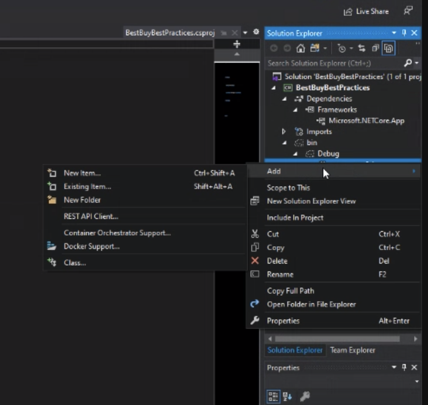

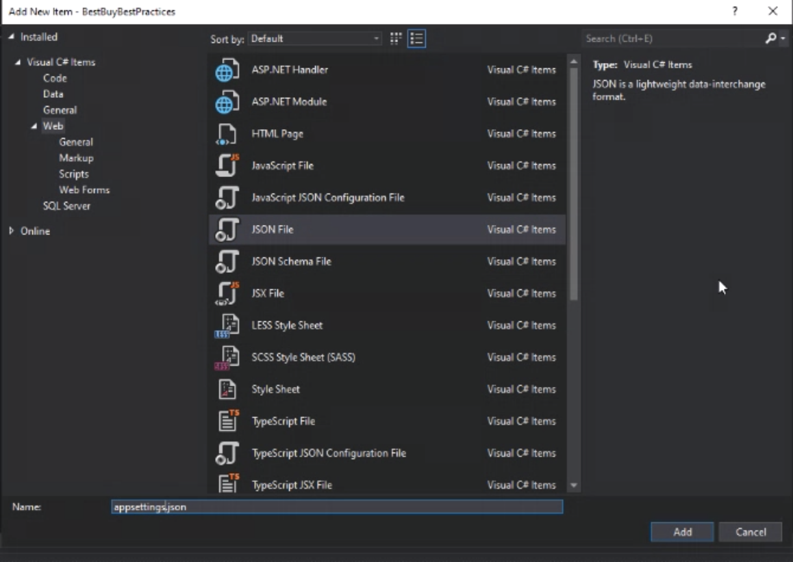

**WINDOWS: Access git ignore file**

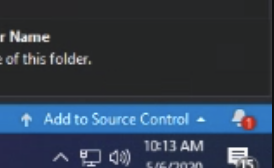

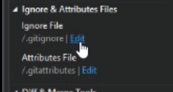

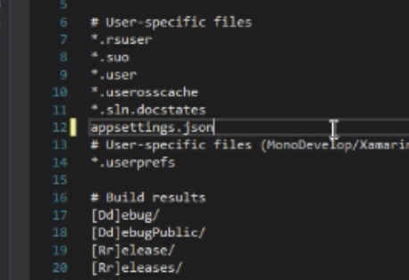
