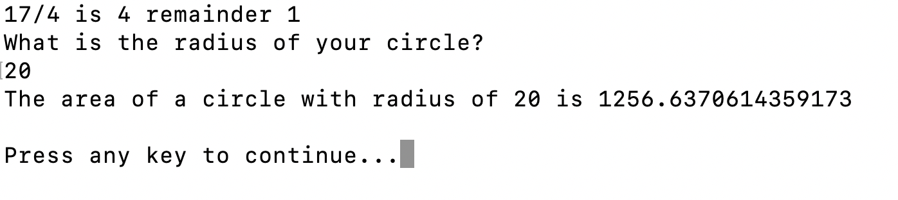

# C# Operators

## Why:		 	 	 		 						
You’ve been working with operations since you first learned how to add. In math, an operation is a calculation that (usually) takes two numbers and does something with them to get a result. Addition is an example of an operation, as is multiplication. Operations usually have two pieces to them: an **operator** (like the ‘+’ sign) and operands. **Operand** is just a fancy name for the thing that the operator works on. So if we look at the operation 2 + 3, the numbers 2 and 3 are operands.
Not all operators require two operands. Those that do are called **binary operators**. These are probably the ones you are most familiar with. We’ll also see some that only need one operand. These are called **unary** operators. C# also has an operator that requires three operands. It’s a **ternary operator**. 
				
## What/How:
**Arithmetic Operator**
These are used to perform arithmetic/mathematical operations on operands. The Binary Operators falling in this category are :
**Addition**: The ‘+’ operator adds two operands. For example, x+y
**Subtraction**: The ‘-’ operator subtracts two operands. For example, x-y
**Multiplication**: The ‘\*’ operator multiplies two operands. For example, x\*y
**Division**: The ‘/’ operator divides the first operand by the second. For example, x/y
**Modulus**: The ‘%’ operator returns the remainder when the first operand is divided by the second. For example, x%y


**Unary Operator**
Increment: The ‘++’ operator is used to increment the value of an integer. When placed before the variable name (also called pre-increment operator), its value is incremented instantly. For example:
```cs
++x
int x = 3;
int y = ++x;
// x is 4, y is 4
```
	

And when it is placed after the variable name (also called post-increment operator), its value is preserved temporarily until the execution of this statement and it gets updated before the execution of the next statement. For example, x++(postfix).
		NOTE: (x++) is equivalent to (x = x + 1)
		
```cs
int x = 10;
x++;
Console.WriteLine(x);
// Outputs 11
```
 
Decrement: The ‘- -‘ operator is used to decrement the value of an integer. When placed before the variable name (also called pre-decrement operator), its value is decremented instantly. For example:
```cs
--x
int b = 5;
Console.WriteLine(--b);
// Outputs 4
```

And when it is placed after the variable name (also called post-decrement operator), its value is preserved temporarily until the execution of this statement and it gets updated before the execution of the next statement. For example:
```cs
x--
int a = 4;
Console.WriteLine(a--);  
// Outputs 4
```
		


**Relational Operator**

Relational operators are used for comparison of two values.
- == **(Equal To)** operator checks whether the two given operands are equal or not. If so, it returns true. Otherwise, it returns false. For example, 5 == 5 will return true.
- != **(Not Equal To)** operator checks whether the two given operands are equal or not. If not, it returns true. Otherwise, it returns false. It is the exact boolean complement of the ‘==’ operator. For example, 5 != 5 will return false.
- \> **(Greater Than)** operator checks whether the first operand is greater than the second operand. If so, it returns true. Otherwise, it returns false. For example, 6 > 5 will return true.
- < **(Less Than)** operator checks whether the first operand is lesser than the second operand. If so, it returns true. Otherwise, it returns false. For example, 6 < 5 will return false.
- \>= **(Greater Than Equal To)** operator checks whether the first operand is greater than or equal to the second operand. If so, it returns true. Otherwise, it returns false. For example, 5 >= 5 will return true.
- \<= **(Less Than Equal To)** operator checks whether the first operand is lesser than or equal to the second operand. If so, it returns true. Otherwise, it returns false. For example, 5 <= 5 will also return true.

**Logical Operator**

Logical operators are used to combine two or more conditions or to complement the evaluation of the original condition in consideration.
- AND: The **&&** operator returns true when both the conditions in consideration are satisfied. Otherwise, it returns false. For example, 5 == 5 && 5 > 10 returns true when both a and b are true.
- OR: The **||** operator returns true when one (or both) of the conditions in consideration is satisfied. Otherwise, it returns false. For example, a || b returns true if one of a or b is true. It returns true when both a and b are true.
- NOT: The **!** operator returns true if the condition in consideration is not satisfied. Otherwise, it returns false. For example, !a returns true if a is false. (Opposite Operator)

**Assignment Operator**

Assignment operators are used to assign a value to a **variable**. The left side operand of the assignment operator is a variable and the right side operand of the assignment operator is a **value**. The value on the right side must be of the same data-type of the variable on the left side otherwise the compiler will raise an error.

**=** (Simple Assignment): This is the simplest assignment operator.


Example:
```cs
a = 10;
b = 20;
ch = 'y';
```

**+=** (Add Assignment): This operator is a combination of ‘+’ and ‘=’ operators. This operator first adds the current value of the variable on the left to the value on the right and then assigns the result to the variable on the left.

- Example:
```cs
int a = 5;
int b = 6;
Console.WriteLine(a += b); // same as (a = a + b)
// If the initial value stored in a is 5 and b is 6. Then (a += 6) = 11.
```
**-=** (Subtract Assignment): This operator is a combination of ‘-‘ and ‘=’ operators. This operator first subtracts the current value of the variable on the left from the value on the right and then assigns the result to the variable on the left.

- Example: 
```cs
int a = 8;
int b = 6;
Console.WriteLine(a -= b); // same as (a = a - b) or 2 = 8 - 6
// If the initial value stored in a is 8 and b is 6. Then (a -= 6) = 2.
```
**\*=** (Multiply Assignment): This operator is a combination of ‘*’ and ‘=’ operators. This operator first multiplies the current value of the variable on the left to the value on the right and then assigns the result to the variable on the left.

- Example:
```cs
int a = 5;
int b = 6;
Console.WriteLine(a *= b); // same as (a = a * b)
// If the initial value stored in a is 5 and b is 6. Then (a *= 6) = 30.
```

**/=** (Division Assignment): This operator is a combination of ‘/’ and ‘=’ operators. This operator first divides the current value of the variable on the left by the value on the right and then assigns the result to the variable on the left.

- Example :
```cs
int a = 6;
int b = 2;
Console.WriteLine(a /= b); // same as (a = a / b)
// If the initial value stored in a is 6 and b is 2. Then (a /= 2) = 3.
```
**%=** (Modulus Assignment): This operator is a combination of ‘%’ and ‘=’ operators. This operator first modulo the current value of the variable on the left by the value on the right and then assigns the result to the variable on the left.

- Example :
```cs
int a = 6;
int b = 2;
Console.WriteLine(a %= b); // same as (a = a % b) 
// If the initial value stored in a is 6. Then (a %= 2) = 0.
```
**Ternary Operator**
The ternary operator, also known as the Inline-if and is **syntax sugar**, is a shorthand version of if-else statement. The word ternary means composed of three parts, so it makes sense that this operator has three operands. It will return one of two values depending on the value of a Boolean expression.

**Syntax**:
 ```cs
condition ? trueScope : falseScope;
```
 
**Explanation** :
 - **condition**: It must be evaluated to true or false.
 - **truescope**: If the condition is true,
trueScope is evaluated and becomes the result.
 - **falsescope**: If the condition is false,
falseScope is evaluated and becomes the result.
 
 
Example:
```cs
var i = 1;
var positiveMessage = (i > 0) ? "You are positive!" : "You're not positive.”;
```

# Exercise:		

Video to help you with the exercise:
- **Mac**: https://youtu.be/wLrql8V7sgQ
- **Windows**: https://drive.google.com/file/d/1ecZ_B0aHcvIEmkER5nc3RL81LmPtjw0P/view?usp=sharing 
*Lecture with demonstration, Not the exercise answer
	
## Exercise 1
- Create a simple program named OperatorExercise in your repos folder to write out the results of addition, subtraction, multiplication, division operations. 
- For division, create two integer variables called a and b. 
- Create a third integer variable and name it quotient (the result of a division) that stores the result of the division of a and b, and another integer variable named remainder that stores the remainder (using the % operator). 
- Write out the results using Console.WriteLine or Console.Write to write out the results in the following form: if a = 17 and b = 4, print the following:	
17/4 is 4 remainder 1			
________________________________________________________________
## Exercise 2

- Create a method that will Calculate the area of a circle based on its radius - you can name the method AreaOfCircle
- This method will use this formula pi * r ^ 2 and return the area of type double
- The method will also accept r as a parameter
- Allow a user to input a value for r in the console using the following code:
 ```cs
var radius = double.Parse(Console.ReadLine());
```
- When finished your output should look something like this:





Thought Exercise:
What is the value of k in the following code?:
```cs
var i = 3;
var j = 4; 
var k = ++i * j++;
Console.WriteLine(k);
```


### Quiz:
https://docs.google.com/forms/d/1i7EDO68hbRpnFPY8QuyIW3dzpLm4-3f8yOlT0wvwONM/edit

