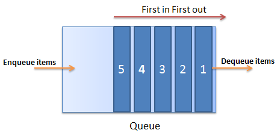

# Value and Reference Types

## Why:
We teach Value and Reference types because C# is a strongly AND statically typed object-oriented programming language.  Strongly - meaning that once a variable’s type is declared, it cannot change, although you can change its value; Statically - meaning that every variable must have a type at compile time.  So you can see that types and knowing how they function is pretty important.  In this lesson, we’ll cover what the types are, how they function, and how we will utilize them as we begin programming in C#.


## What: 
 
## **Value Types**  
Value Types are stored in a memory location called the stack 


Some Value Type examples are
1. bool 
2. char
3. int 
4. decimal 
5. enum 

... more are listed on the types page here: https://learn.truecoders.io/csharp/types/ 
 
*Value types store the actual data rather than a reference to it. 
 
*Value Types are not automatically nullable.  While reference types automatically support being set to null, value types require an actual value. When you need to assign null to a value type, you employ the "nullable" of that type. A value type, followed by a ? is shorthand syntax for nullable:
```cs
int? myInteger = null; // The ? is for nullable
```

**Signed vs. Unsigned:**

**Signed:** A signed integer is one with either a plus or minus sign  
in front. That is it can be either positive or negative. 
  
**Unsigned:** The integer is assumed to be positive. 
 
 ----
 
## **Reference Types**
Reference Types are stored in a memory location called the heap


1. String
2. Array 
3. Classes
4. Lists

*These are automatically nullable 
 
A **reference type** is set by storing the actual data (object) in memory and storing a reference to the object within the variable. Reference types in C# automatically support being set to null. 
 
 
Reference vs. Value Types:
 
Value types actually hold values. Assigning one value type to another literally copies the value. 
 
Examples include 
- structs 
- enums 
- booleans
- numeric types. 
 
 
Reference types are objects that store references to the actual data.  
 
Examples include 
- classes
- interfaces
- objects
- strings
 
 

The Stack is used for static memory allocation.  This is where Value Types are stored. 

It utilizes a LAST IN, FIRST OUT procedure.   
So the last item that enters the stack is the first item that leaves. 


The Heap is used for dynamic memory allocation.  This is where Reference types are stored. 
Elements can be removed in any order from the heap 

The heap is used for custom objects that may require additional memory during the runtime of the program 
 
The Queue is a FIRST IN, FIRST OUT  collection of elements where the first element that goes into a queue is the first element that comes out 



## How:

With a value type, when you copy a variable you create a clone of the actual value.
Let's see how this works with an integer.

```cs
int a = 1; // value type int
int b = a; // clone the value of 'a' 

a = 2; // Change the contained value of 'a'

// Now 'a' equals 2 && 'b' equals 1

```

With a reference type, when you copy a variable you create a clone of the reference to the same actual data value.

Let's see how this works with a class called Point:
```cs
public class Point 
{ 
     public int X;
     public int Y;
}

Point p1 = new Point();
p1.X = 7

Point p2  = p1; // Copies p1 reference

Console.WriteLine(p1.X); //prints 7
Console.WriteLine(p2.X); //prints 7

p1.X = 9; //Change p1.X
Console.WriteLine(p1.X); //prints 9
Console.WriteLine(p2.X); //prints 9
```
Notice in the above code that p1 and p2 are two references that point to the same object, therefore, when p1 changes the value of p1.X to 9 then p2.X also equals 9.

# Exercise

Complete this exercise and use these videos for help!

**Mac:** https://youtu.be/8d_gdEIj7s0 

**Windows:** https://drive.google.com/file/d/18TTkuvSogTT3kpdL0LoIg9b1N8HhzTSE/view?usp=sharing 

*Both of the videos have value regardless of your operating system*

The following assignment is a console application:

1. Fork the exercise https://github.com/mvdoyle/ChristmasWithTypes  and clone it to your machine.  

2. Navigate to the ChristmasWithTypes folder and open the ChristmasWithTypes.sln file - Make sure it opens with Visual Studio (not VS Code)

3. Complete each TODO in the project - This will remove the errors currently residing in the project.  

In this exercise, you will get some experience with reference and value types, enums, arrays, strings, and making value types nullable.  To complete this assignment, your console should output something like this:


When finished push your application to GitHub

## Quiz:
https://drive.google.com/open?id=1T4V1Gnww4i1ARS89K9VwMqNHkc5gnYDJg7bZyHykGGg


Extra Sources: 

- Stackify: https://stackify.com/what-is-csharp-queue/

- Stack Exchange: https://cs.stackexchange.com/questions/50940/is-queue-a-storage-allocation-area-in-memory

- Interview question: heap vs stack (C#) https://dev.to/tyrrrz/interview-question-heap-vs-stack-c-5aae

- Type Safety in .NET https://www.c-sharpcorner.com/UploadFile/vikie4u/type-safety-in-net/

