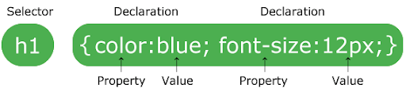
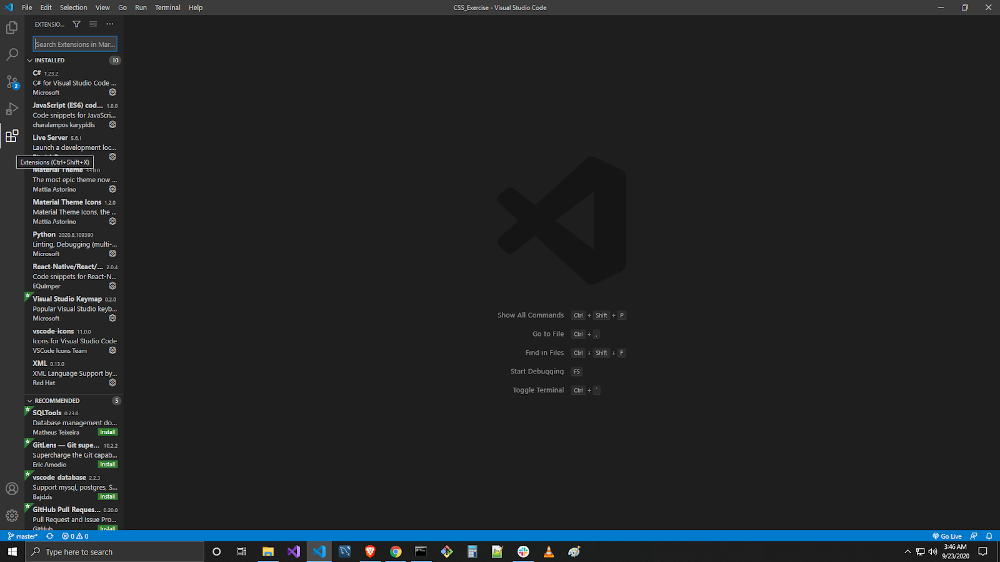
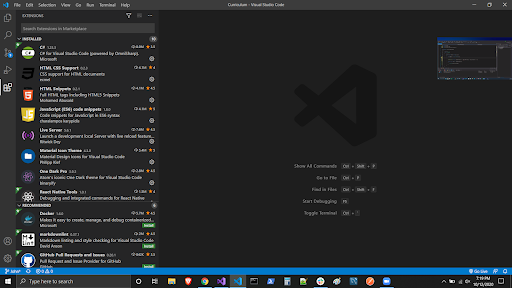
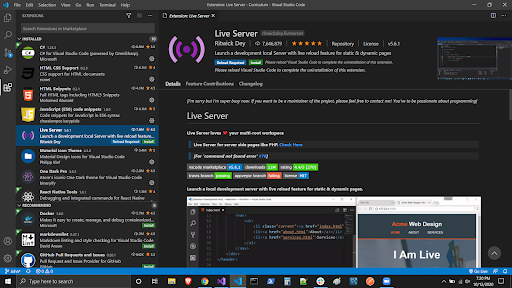
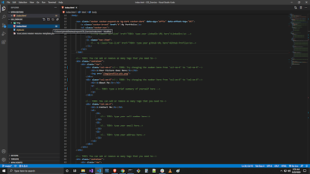
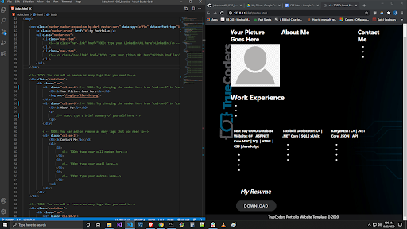

# CSS Introduction

## Why:
So why use CSS? CSS helps you to keep the informational content of a document separate from the details of how to display it. The details of how to display the document are known as its style. You keep the style separate from the content so that you can avoid duplication, make maintenance easier, and use the same content with different styles for different purposes.

Your web site might have thousands of pages that look similar. Using CSS, you store the style information in common files that all the pages share. When a user displays a web page, the user’s browser loads the style information along with the content of the page. When a user prints a web page, you might provide different style information that makes the printed page easier to read.

In general, you use HTML to describe the content of the document, not its style, you use CSS to specify its style, not its content. There are exceptions to this rule, of course, and HTML also provides some ways to specify style. For example, in HTML you can use a **\<b>** tag to make text bold, and you can specify the background color of a page in its **\<body>** tag. When you use CSS, you normally avoid using these HTML style features so that all your document’s style information is in one place.

## What:
CSS stands for Cascading Style Sheets. Cascading refers to the way CSS applies one style on top of another. Style Sheets control the look and feel of web documents. CSS and HTML work hand in hand. HTML sorts out the page structure and CSS defines how HTML elements are displayed. There are 3 types of CSS.. 
- inline css
- internal css
- external css.

## Inline CSS

Using an inline style is one of the ways to insert a style sheet. With an inline style, a unique style is applied to a single element. In order to use an inline style, add the style attribute to the relevant tag.The example below shows how to create a paragraph with a gray background and white text:

```html
<p style="color:white; background-color:gray;"></p>
```

## Embedded/Internal CSS
Internal styles are defined within the **\<style>** element, inside the head section of an HTML page.
 
For example, the following code styles all paragraphs:

```html
<html>
    <head>
        <style>
        p {
            color:white;
            background-color:gray;
        }
        </style>
    </head>
    <body>
        <p>This is my first paragraph. </p>
        <p>This is my second paragraph. </p>
    </body>
</html>
```
## External CSS
With this method, all styling rules are contained in a single text file, which is saved with the .css extension. This CSS file is then referenced in the HTML using the <link> tag. The <link> element goes inside the head section. Here is an example:
The HTML:

```html
<head>
    <link rel="stylesheet" href="example.css">
</head>
<body>
    <p>This is my first paragraph.</p>
    <p>This is my second paragraph.</p>
    <p>This is my third paragraph.</p>
</body>
```
We will be using External CSS from now on because it is best practice.

## How:

To create custom CSS for our HTML we must follow the rules for CSS syntax. 



- The **Selector** points to the HTML element you want to style. 
- The **Declaration** block contains one or more declarations separated by semicolons. 
- Each declaration includes a CSS property **Name and a Value**, separated by a **colon**. 
- Multiple CSS declarations are separated with semicolons, and declaration blocks are surrounded by curly braces.

```css
p { /* P is a selector in CSS (it points to the HTML element you want to style: **\<p>**). */
    color: red; /* Color is a property, and red is the property value. */
    text-align: center; /* Text-align is a property, and center is the property value. */
}
```
## CSS Selectors
CSS selectors are used to “find” (or select) the HTML elements you want to style. We can divide CSS selector into 5 categories:
1. Simple selectors (select elements based on name, id, class)
2. Combinator selectors (select elements based on a specific relationship between them)
3. Pseudo-class selectors (select elements based on a certain state)
4. Pseudo-elements selectors (select and style a part of an element)
5. Attribute selectors (select elements based on an attribute or attribute value)

To keep things simple, we will only go over the simple selectors
### **CSS Element Selector**
The element selector selects HTML elements based on the element name.

 In the example below all **\<p>** elements on the page will be center-aligned, with a red text color:

```css
/*div is another common Selector*/
p {
    text-align: center;
    color: red;
}
```
### **CSS ID Selector**
The id selector uses the **id** attribute of an HTML element to select a specific element. The **id** of an element is unique within a page, so the id selector is used to select one unique element. To select an element with a specific id, write a hash (#) character, followed by the id of the element. The CSS rule below will be applied to the HTML element with id=”para1”:

```css
#para1 {
    text-align: right;
    color: green;
}
```

### **CSS Class Selector**
The Class selector selects HTML elements with a specific class attribute. To select elements with a specific class, write a period (.) character, followed by the class name. 

```css
.center {
    text-align: left;
    color: blue;
}
```

### **CSS Universal Selector**
The universal selector (*) selects all HTML elements on the page. The CSS rule below will affect every HTML element on the page:
```css
* {
    text-align: center;
    color: blue;
}
```

### **CSS Grouping Selector**
The grouping selector selects all the HTML elements with the same style definitions. The following CSS code has elements which all have the same style definitions.

```css
h1 {
    text-align: center;
    color: red;
}

h2 {
    text-align: center;
    color: red;
}

p {
    text-align: center;
    color: red;
}
```

In this example it is better to group the selectors to minimize the code. To group selectors, separate each selector with a comma.

```css
h1, h2, p {
    text-align: center;
    color: red;
}
```

# Exercise
Fork the project from GitHub, clone it to your local machine, and then push it to your GitHub when you are finished!

**Project Link:** https://github.com/johndward01/CSS_Exercise

***This is a continuation of the HTML Intro Exercise*** 

Instructions:
- Complete the TODO’s inside of the style.css file 
- Hint: /*  This is a comment  */
- Be creative and feel free to experiment with changing different elements in your project

To help you see the changes you make affect your website in near real-time we will be using the LiveServer extension. See below for instructions to set it up…

1.  Open Visual Studio Code and click on the extension icon



2. Expand out your extensions side bar



3. Type Live Server in the search bar and choose the top 1 ( 7M+ downloads)



4. Click the green button that says install (very fast installation). Then close that tab and open up the folder that you cloned into your repos folder.

5. Click on the index.html file in the explorer



6. Then in the bottom right corner click on the “GoLive” button and your webpage should pop up. You can snap it to one half of the screen and have your VS Code editor on the other. Now all you need to do to see the changes update is to save. Click back somewhere in side the editor and save.

Windows: (ctrl + s) 

 Mac: (command + s )

 

## Quiz:
https://docs.google.com/forms/d/e/1FAIpQLSfg2i-i5aRNGSLS1lWquz2dDeEh4lOXzkwa2IW-QE4W-JBzDA/viewform?usp=sf_link
