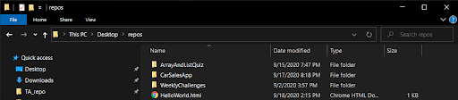

# HTML Introduction


## Why:	
HTML —which is short for **HyperText Markup Language**— is the official language of the World Wide Web and was first conceived in 1990. HTML was originally created to allow those who were not specialized in SGML (Standard Generalized Markup Language) to publish and exchange scientific and other technical documents. HTML especially facilitated this exchange by incorporating the ability to link documents electronically using hyperlinks. Hypertext documents are interconnected by hyperlinks, which are typically activated by a mouse click, keypress, or by touching the screen. The first publicly available description of HTML was a document called “HTML Tags”, first mentioned on the Internet by Tim Berners-Lee in late 1991. It describes 18 elements comprising the initial, relatively simple design of HTML.

## What:
So what is a markup language anyways? In computer text processing, a markup language is a system for annotating a document noticeably different from the text. When the document is processed for display, the markup language is not shown, and is only used to format the text. The following is an example of the classic “Hello World” program:

```html
<!DOCTYPE html>
<html>
    <head>
        <title>This is a title</title>
    </head>
    <body>
        <div>
            <h1>Hello World!</h1>
        </div>
    </body>
</html>
```
The example above will display “Hello world!” on the webpage. The text “This is a title” is in the head element and therefore will not be shown.


## How:
HTML documents are files that end with a **.html** or **.htm** extension. You can view them using any web browser (such as Google Chrome, Safari, or Mozilla Firefox). To open an HTML file double click on that file (with either a .html or .htm extension) and it will open up in your browser.



**The Document Object Model (DOM)** is the data representation of the objects that comprise the structure and content of a document on the web.The **DOM** is a programming interface for HTML and XML documents. It represents the page so that programs can change the document structure, style, and content. The DOM represents the document as nodes and objects. That way, programming languages can connect to the page.
A Web page is a document. This document can be either displayed in the browser window or as the HTML source. But it is the same document in both cases. The DOM represents that same document so it can be manipulated. The DOM is an object-oriented representation of the web page. Each HTML page consists of a set of tags (also called elements), which you can refer to as the building blocks of web pages. They create a hierarchy that structures the content into sections, paragraphs, headings, and other content blocks. Most HTML elements have an opening and a closing that use the **\<tag>\</tag>** syntax. HTML tags have two main types: block-level and inline tags.


## Block-Level Tags

**Block-level elements** take up the full available space and always start a new line in the document. Headings **\<h1>\</h1>** and paragraphs **\<p>\</p>** are a great example of block tags.
The three block level tags every HTML document needs to contain are \<html> , \<head>, and \<body>.
1. The **\<html>\</html>** tag is the highest level element that encloses every HTML page.
2. The **\<head>\</head>** tag holds meta information such as the page’s title and charset.
3. Finally, the **\<body>\</body>** tag encloses all the content that appears on the page.

```html
<html>
    <head>
        Meta information goes here
    </head>
    <body>
        Page content goes here
    </body>
</html>
```
Some common HTML tags you will see are: 
- The Heading tags **\<h1>\</h1>** are another common block-level tag and they range from **\<h1>\</h1>** to **\<h6>\</h6>**. The h1 tag is the largest and the h6 tag is the smallest heading size.

```html
<!DOCTYPE html>
<html>
<head>
    <title>This is a title</title>
</head>
<body>
    <div>
        <h1>This is a heading</h1>
        <h2>This is a heading</h2>
        <h3>This is a heading</h3>
        <h4>This is a heading</h4>
        <h5>This is a heading</h5>
        <h6>This is a heading</h6>
    </div>
</body>
</html>
```


- The Paragraph tag **\<p>\</p>**  is used to enclose text

```html
<!DOCTYPE html>
<html>
<head>
    <title>This is a title</title>
</head>
<body>
    <div>
        <p>Lorem Ipsum is simply dummy text of the printing and typesetting industry. Lorem Ipsum has been the industry's standard dummy text ever since the 1500s, when an unknown printer took a galley of type and scrambled it to make a type specimen book. It has survived not only five centuries, but also the leap into electronic typesetting, remaining essentially unchanged. It was popularised in the 1960s with the release of Letraset sheets containing Lorem Ipsum passages, and more recently with desktop publishing software like Aldus PageMaker including versions of Lorem Ipsum.</p>
    </div>
</body>
</html>
```


- The Division tag **\<div>\</div>** is a large container which usually contains several other HTML elements within it, even including other div tags (nesting elements within elements). 

```html
<!DOCTYPE html>
<html>
<head>
    <title>This is a title</title>
</head>
<body>
    <div>
        <h1>HTML Inception</h1>
        <div>
        <p>Lorem ipsum dolor sit amet, consectetur adipiscing elit... </p>
        </div>
    </div>
</body>
</html>
```


## Inline Tags

**Inline elements** only take up as much space as they need and don’t start a new line on the page. They usually serve to format the inner contents of block-level elements. Links and emphasized strings are good examples of inline tags.
Many inline tags are used to format text. For example, a **\<strong>\</strong>** tag would render an element in **bold**, whereas **\<em>\</em>** tags would show it in *italics*. 

```html
<div>
    <h1><strong>This is a bold heading</strong></h1>

    <h1><em>This is an italicized heading</em></h1>

</div>
```
Hyperlinks are also inline elements that require **\<a>\</a>** tags and href attributes to indicate the link’s destination:

```html
<div>
       <a href=”https://learn.truecoders.io/web/html/”>TrueCoders HTML</a>
</div>

```
This is an example of the difference between the Block and Inline tags. *Notice how the inline doesn't take up the whole block*
```html
<div>   

    <style> /*This is a style tag and will be discussed in the CSS Intro*/
        .highlight {
            background-color:#ee3;
        }
    </style>

    <!-- This paragraph has the inline tag <span></span> highlighted -->
        <p>Lorem ipsum dolor sit amet, <span class="highlight">consectetur adipiscing elit</span>, sed do eiusmod tempor incididunt ut labore et dolore magna aliqua</p>

    <!-- This paragraph has the block tag <p></p> highlighted -->
        <p class="highlight">Lorem ipsum dolor sit amet, consectetur adipiscing elit, sed do eiusmod tempor incididunt ut labore et dolore magna aliqua.</p>

</div>
```


Images are inline elements too. You can add one using **\** without any closing tag. But you will also need to use the src attribute to specify the image path, for example:
```html
    
```

 For a comprehensive list of all HTML tags visit https://www.w3schools.com/tags/

## HTML Attributes
HTML attributes are additional values that configure the elements or adjust their behavior in various ways to meet the criteria the users want. All HTML elements can have attributes and they are always specified in the start tag. Attributes usually come in name/value pairs like: **name=”value”** 

### The **href** Attribute 
 The **\<a>** tag defines a hyperlink. The href attribute specifies the URL of the page the link goes to: 
 ```html
 <a href=”https://learn.truecoders.io/web/html/”>TrueCoders HTML\</a>
 ```

### The **src** Attribute 
 The **\** tag is used to embed an image in an HTML page. The **src** attribute specifies the path to the image to be displayed:
 ```html
  
  ```

### The **title** Attribute 
 The title attribute defines some extra information about an element. The value of the title attribute will be displayed as a tooltip when you mouse over the element: 
 ```html
<p title="I'm a tooltip">This is a paragraph.</p>
```

### The **lang** Attribute 
 You should always include the **\<html>** tag, to declare the language of the web page.
This is meant to assist search engines and browsers. Example of english as the language:
```html
<!DOCTYPE html>
<html lang=”en”>
       <body>
       </body>
</html>
```
For a comprehensive list of all HTML attributes for each element check out: https://www.w3schools.com/tags/ref_attributes.asp

# Exercise
***This exercise will be continued in the next Lecture (CSS Intro)***

1. Create a folder to store all your files in for this lecture called **FrontEnd**
2. Fork the project from GitHub
3. Clone it to your local machine 
4. Then push it to your GitHub when you are finished

**Project Link: https://github.com/johndward01/HTML_Exercise**

Instructions:
- Inside of the HTML document there will be multiple comments throughout which you will have to enter in your information to create your own personal portfolio website
- Once you have put in your info, then uncomment that block of code

- Hint: **\<!-- -->**  This is a comment in HTML

Before:
```html
<li class="nav-item">
<!-- <a class="nav-link" href="TODO: type your github URL here">GitHub Profile</a>-->
```
After:
```html
<a class="nav-link" href="https://github.com/johndward01">GitHub Profile</a>
```
### Before we begin the exercise we will step through the process of setting ourselves up...

(continued below)

1. Open up VS Code (close the Welcome tab)


2. Open the folder we cloned in the repos folder


3. Expand out the folder and click on index.html


4. Complete all the comments inside the HTML document (TODO's)

## Quiz:
https://drive.google.com/open?id=1fn1rhoUXs_q6_NeKrgvNtILTPkjHpEWg