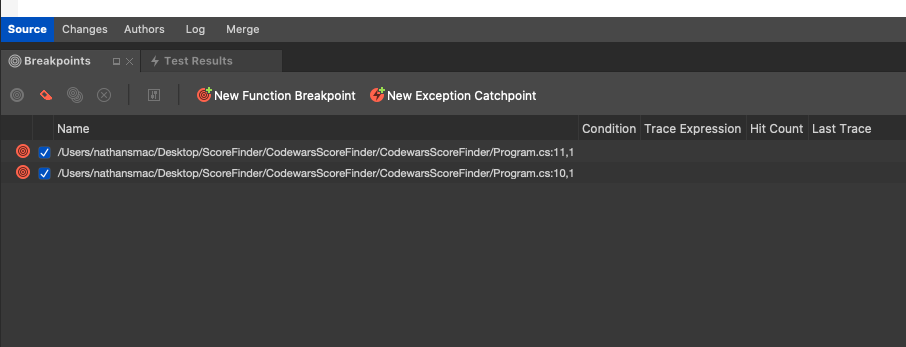

# IDE Parts: Visual Studio Community 2019

## Why:

Margaret Hamilton stands next to a stack of Apollo Guidance Computer source code. In the time before IDEs.

The very first contract NASA issued for the Apollo program (in August 1961) was with the Massachusetts Institute of Technology to develop the guidance and navigation system for the Apollo spacecraft. Hamilton, a computer programmer, would wind up leading the Software Engineering Division of the  ~~MIT Instrumentation Laboratory~~ (now Draper Labs). Computer science, as we now know it, was just coming into existence at the time. Hamilton led the team that developed the building blocks of software engineering – a term that she coined herself. Her systems approach to the Apollo software development and insistence on rigorous testing was critical to the success of Apollo. As she noted, “There was no second chance. We all knew that.”

## What:
Signed-in users will see the new start window, which shows a list of recent projects, and buttons to open an existing project or create a new one: 

The following image shows Visual Studio for Mac with an application loaded:

**Solution Pad**
The Solution Pad organizes the project(s) in a solution:

This is where files for the source code, resources, user interface, and dependencies are organized into platform-specific Projects.

### Dependencies / Packages
- All external dependencies used in your app are stored in the Dependencies or Packages folder, depending on whether you are in a .Net Core or Xamarin.iOS/Xamarin.Android project. These are usually provided in the form of a NuGet.
- NuGet is the most popular package manager for .NET development. With Visual Studio's NuGet support, you can easily search for and add packages to your project.
- To add a dependency to your application, right-click on the Dependencies / Packages folder, and select Add Packages:

### Using the Debugger
To start debugging any application, always ensure that the configuration is set to Debug. The debug configuration provides a helpful set of tools to support debugging, such as breakpoints, using data visualizers, and viewing the call stack:

### Setting a Breakpoint
To set a breakpoint in your IDE, click on the margin area of your editor, next to the line number of the code where you wish to break:

You can view all the breakpoints that have been set in your code by going to the Breakpoints pad:

## Debug in Visual Studio and track C# code with ‘Watch’

To use debugging tools we first need to start our C# application under a debugger. In Visual Studio we do that with 
- **F5** - Start Debugging 
- **F11** - Step Into
- The **Run To Cursor** option. (right click your code to see this option)
- Or you can click the **Debug** menu button at the top (Windows)
and choose 'Start Debugging'

### To open the **Watch** window \*MUST BE IN DEBUG MODE FIRST

1. click on the **Debug** menu item in Visual Studio
2. hover your mouse cursor over **Windows**
3. hover your mouse cursor over **Watch**
4. select **Watch 1** (or any of the other watch windows). *An alternative is the Ctrl + Alt + W, 1 key combination.*

While you're debugging, you can use Watch windows and QuickWatch to watch variables and expressions. The windows are only available during a debugging session.
Watch windows can display several variables at a time while debugging. The QuickWatch dialog displays a single variable at a time, and must be closed before debugging can continue.

## Output to Console Window or Application Output Window
By default our project outputs to our console, either command prompt or Terminal for mac, however we can change this to actually output to our own IDE. In VS 2019 we have the Application Output Window. To change this setting, 
- Right click the project in the Solution window 
- select Options to open the Project Options dialog
- Then go to Run - Configurations -
-  Default and uncheck the 'Run on external console' check box

## Call Stack

By using the Call Stack window, you can view the function or procedure calls that are currently on the stack. The Call Stack window shows the order in which methods and functions are getting called. The call stack is a good way to examine and understand the execution flow of an app.

While debugging, in the Debug menu, select Windows > Call Stack.

A yellow arrow identifies the stack frame where the execution pointer is currently located. By default, this stack frame's information appears in the source, Locals, Autos, Watch, and Disassembly windows. To change the debugger context to another frame on the stack, switch to another stack frame.

### **View the source code for a function on the call stack**
In the Call Stack window, right-click the function whose source code you want to see and select Go To Source Code.

### **Run to a specific function from the Call Stack window**
In the Call Stack window, select the function, right-click, and then choose Run to Cursor.  The function will run in the context where the current breakpoint is paused.

### **Display calls to or from another thread**
Right-click the Call Stack window and select Include Calls To/From Other Threads.

### **Visually trace the call stack**
*In Visual Studio Enterprise (only), you can view code maps for the call stack while debugging.
In the Call Stack window, open the shortcut menu. Choose Show Call Stack on Code Map (Ctrl + Shift + `).*

### **Breaking on Exceptions**
By default, when run in debug mode, the debugger will break on all uncaught exceptions.
In the Exception Settings window (Debug > Windows > Exception Settings), expand the node for a category of exceptions, such as Common Language Runtime Exceptions. Then select the check box for a specific exception within that category, such as System.AccessViolationException. You can also select an entire category of exceptions.

### **Control Click to Navigate**	

The Go To Definition feature navigates to the source of a type or member, and opens the result in a new tab. If you are a keyboard user, place your text cursor somewhere inside the symbol name and press F12. If you are a mouse user, either select Go To Definition from the right-click menu or use the Ctrl-click functionality described in the following section.

## Ctrl-click Go To Definition
Ctrl+click is a shortcut for mouse users to quickly access Go To Definition. Symbols become clickable when you press Ctrl and hover over the type or member. To quickly navigate to the definition of a symbol, press the Ctrl key and then click on it. It's that easy!

## Intellisense
C# IntelliSense is available when coding in the editor, and while debugging in the Immediate mode command window.

### **Completion lists**
The IntelliSense completion lists in C# contain tokens from List Members, Complete Word, and more. It provides quick access to:
- Members of a type or namespace
- Variables, commands, and functions names
- Code snippets
- Language keywords
- Extension methods

The completion list in C# is also smart enough to filter out irrelevant tokens and pre-select a token based on context. For more information, see Filtered completion lists.
### **Filtered completion lists**
IntelliSense removes unnecessary members from the completion list by using filters. C# filters the completion lists that appear for these items:

- Interfaces and base classes: IntelliSense automatically removes items from the interface and base class completion lists, in both class declaration base and interface lists and constraint lists. For example, enums do not appear in the completion list for base classes, because enums cannot be used for base classes. The completion list of base classes only contains interfaces and namespaces. If you select an item in the list and then type a comma, IntelliSense removes base classes from the completion list because C# does not support multiple inheritance. The same behavior occurs for constraint clauses also.
- Attributes: When you apply an attribute to a type, the completion list is filtered so that the list only contains those types that descend from the namespaces that contain those types, such as Attribute.
- Catch clauses
- Object initializers: Only members that can be initialized will appear in the completion list.
- **new** keyword: When you type new and then press the Space, a completion list appears. An item is automatically selected in the list, based on the context in your code. For example, items are automatically selected in the completion list for declarations and for return statements in methods.
- **enum** keyword: When you press the Space after an equal sign for an enum assignment, a completion list appears. An item is automatically selected in the list, based on the context in your code. For example, items are automatically selected in the completion list after you type the keyword return and when you make a declaration.
- **as** and **is** operators: A filtered completion list is displayed automatically when you press the Space after you have typed the as or is keyword.
- **Events:** When you type the keyword **event**, the completion list only contains delegate types.
- **Parameter** help automatically sorts to the first method overload that matches the parameters as you enter them. If multiple method overloads are available, you can use the up and down arrows to navigate to the next possible overload in the list.
 
# Exercise 
**Use the code from the exercise to answer questions throughout the quiz**
		
### Exercise: 
- Fork and Clone https://github.com/nrice41593/ASP.NETPractice

### Quiz: 
- https://docs.google.com/forms/d/1_PQisjxGClAVxmB7vMRNbNPgnFBzFiRzIowmxNWwEkA/edit

- https://forms.gle/311qxJBiVoksnsY26
